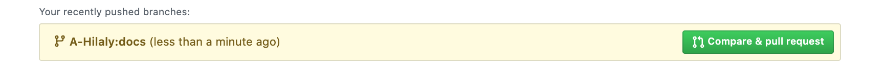

# Setup 

In the following, we walk you through the setup to start developing on AWS Controller for Kubernetes (ACK) in the `mvp` phase.

## Fork the repository

First, fork the [upstream source repository](github.com/aws/aws-controllers-k8s) to your private GitHub account.

Then, on your workstation, run:

```bash
cd go/src/github.com/aws
git clone git@github.com:$GITHUB_ID/aws-service-operator-k8s
cd aws-service-operator-k8s
git remote add upstream git@github.com:aws/aws-service-operator-k8s
```

## Create your local branch

```bash
git fetch --all && git checkout -b $BRANCH_NAME upstream/mvp
```

## Commit changes

Make your changes locally, commit and push using:

```bash
git add . && git commit
git push origin $BRANCH_NAME
```

With an example output:

```bash
Enumerating objects: 6, done.
Counting objects: 100% (6/6), done.
Delta compression using up to 8 threads
Compressing objects: 100% (4/4), done.
Writing objects: 100% (4/4), 710 bytes | 710.00 KiB/s, done.
Total 4 (delta 2), reused 0 (delta 0)
remote: Resolving deltas: 100% (2/2), completed with 2 local objects.
remote: This repository moved. Please use the new location:
remote:   git@github.com:$GITHUB_ID/aws-service-operator-k8s.git
remote: 
remote: Create a pull request for 'docs' on GitHub by visiting:
remote:      https://github.com/$GITHUB_ID/aws-service-operator-k8s/pull/new/docs
remote: 
To github.com:a-hilaly/aws-service-operator-k8s
 * [new branch]      docs -> docs
```

## Create pull request

Finally, submit a pull request against the upstream source repository.

Use either the link that show up as in the example above or to the upstream source repository and open the Pull Request. You'll see a link like the image below:

