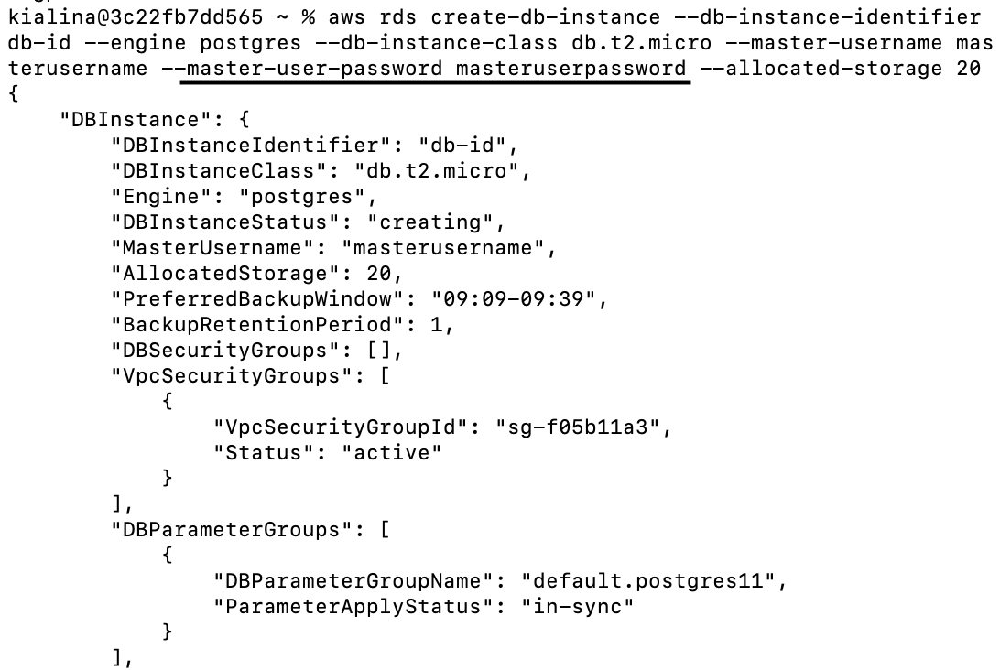
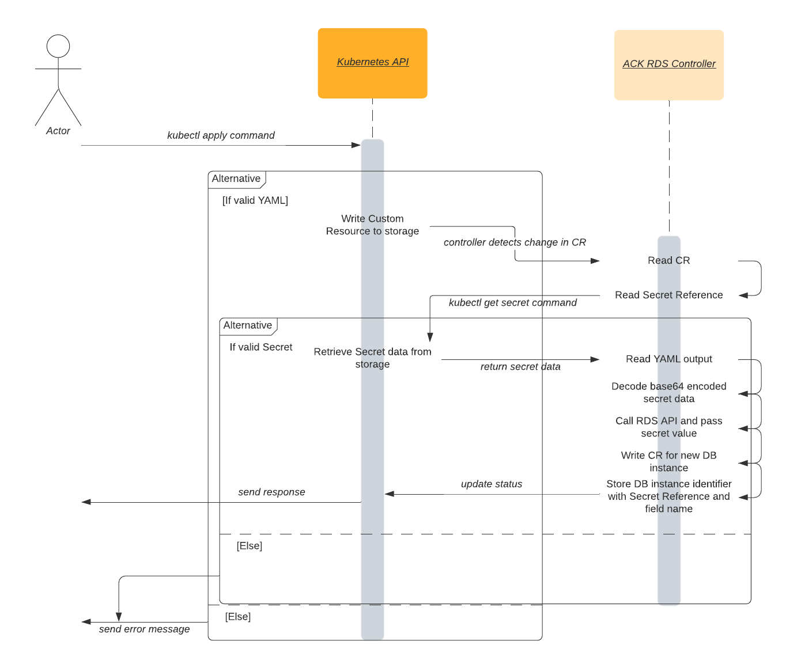
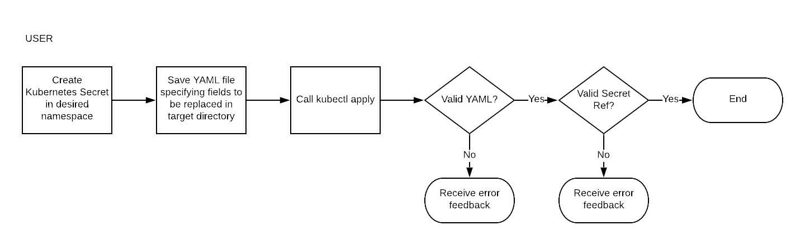
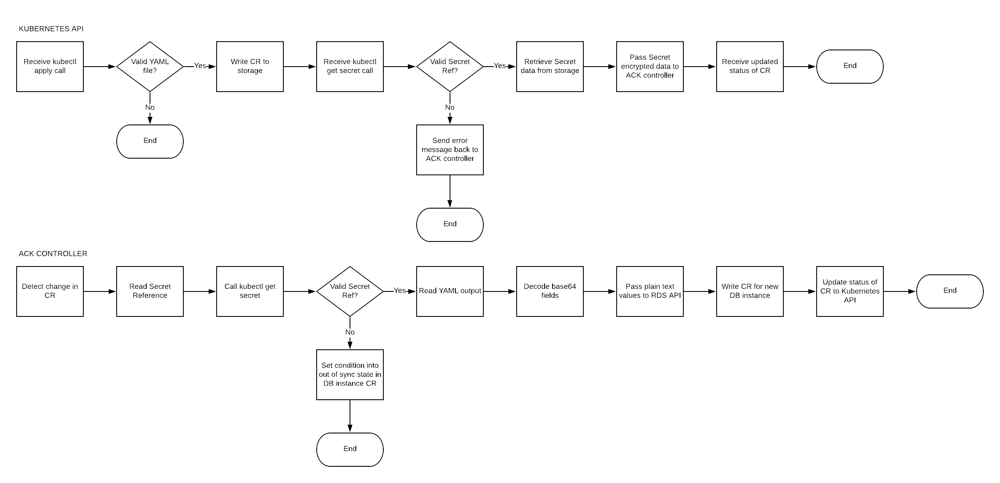

# Secrets Integration Design Doc

## Problem Description

#### Before ACK
Alice is a frequent Kubernetes user excited to create a database instance using [Amazon RDS](https://docs.aws.amazon.com/AmazonRDS/latest/APIReference/Welcome.html). She is very familiar with Kubernetes, but doesn't want to dive into learning about the Amazon API space. She is thrilled to use [ACK, AWS Controllers for Kubernetes](https://github.com/aws/aws-service-operator-k8s), to easily create a MySQL database. Before ACK, Alice needed to manually call the [createDBInstance](https://docs.aws.amazon.com/AmazonRDS/latest/APIReference/API_CreateDBInstance.html) method from the RDS API in the AWS console, and type in a MasterUserPassword in plain text. 


With the method call to create and the method call to describe the DB instance, [her password was in plain text for the API request and response](https://docs.aws.amazon.com/AmazonRDS/latest/APIReference/API_CreateDBInstance.html#API_CreateDBInstance_Examples). That didn't seem very secure to Alice. 
The [Custom Resource Definition](https://kubernetes.io/docs/concepts/extend-kubernetes/api-extension/custom-resources/) currently shows that the MasterUserPassword is a string:

```go
// DBInstanceSpec defines the desired state of DBInstance
type DBInstanceSpec struct {
	AllocatedStorage int64 `json:"allocatedStorage,omitempty" aws:"AllocatedStorage"`
	AutoMinorVersionUpgrade bool `json:"autoMinorVersionUpgrade,omitempty" aws:"AutoMinorVersionUpgrade"`
	AvailabilityZone string `json:"availabilityZone,omitempty" aws:"AvailabilityZone"`
	BackupRetentionPeriod int64 `json:"backupRetentionPeriod,omitempty" aws:"BackupRetentionPeriod"`
	CharacterSetName string `json:"characterSetName,omitempty" aws:"CharacterSetName"`
	CopyTagsToSnapshot bool `json:"copyTagsToSnapshot,omitempty" aws:"CopyTagsToSnapshot"`
	DBClusterIdentifier string `json:"dbClusterIdentifier,omitempty" aws:"DBClusterIdentifier"`
	DBInstanceClass string `json:"dbInstanceClass,omitempty" aws:"DBInstanceClass"`
	DBInstanceIdentifier string `json:"dbInstanceIdentifier,omitempty" aws:"DBInstanceIdentifier"`
	DBName string `json:"dbName,omitempty" aws:"DBName"`
	DBParameterGroupName string `json:"dbParameterGroupName,omitempty" aws:"DBParameterGroupName"`
	DBSecurityGroups []string `json:"dbSecurityGroups,omitempty" aws:"DBSecurityGroups"`
	DBSubnetGroupName string `json:"dbSubnetGroupName,omitempty" aws:"DBSubnetGroupName"`
	DeletionProtection bool `json:"deletionProtection,omitempty" aws:"DeletionProtection"`
	Domain string `json:"domain,omitempty" aws:"Domain"`
	DomainIAMRoleName string `json:"domainIAMRoleName,omitempty" aws:"DomainIAMRoleName"`
	EnableCloudwatchLogsExports []string `json:"enableCloudwatchLogsExports,omitempty" aws:"EnableCloudwatchLogsExports"`
	EnableIAMDatabaseAuthentication bool `json:"enableIAMDatabaseAuthentication,omitempty" aws:"EnableIAMDatabaseAuthentication"`
	EnablePerformanceInsights bool `json:"enablePerformanceInsights,omitempty" aws:"EnablePerformanceInsights"`
	Engine string `json:"engine,omitempty" aws:"Engine"`
	EngineVersion string `json:"engineVersion,omitempty" aws:"EngineVersion"`
	IOPS int64 `json:"iops,omitempty" aws:"Iops"`
	KMSKeyID string `json:"kmsKeyID,omitempty" aws:"KmsKeyId"`
	LicenseModel string `json:"licenseModel,omitempty" aws:"LicenseModel"`
	MasterUserPassword string `json:"masterUserPassword,omitempty" aws:"MasterUserPassword"`
	MasterUsername string `json:"masterUsername,omitempty" aws:"MasterUsername"`
	MaxAllocatedStorage int64 `json:"maxAllocatedStorage,omitempty" aws:"MaxAllocatedStorage"`
	MonitoringInterval int64 `json:"monitoringInterval,omitempty" aws:"MonitoringInterval"`
	MonitoringRoleARN string `json:"monitoringRoleARN,omitempty" aws:"MonitoringRoleArn"`
	MultiAZ bool `json:"multiAZ,omitempty" aws:"MultiAZ"`
	OptionGroupName string `json:"optionGroupName,omitempty" aws:"OptionGroupName"`
	PerformanceInsightsKMSKeyID string `json:"performanceInsightsKMSKeyID,omitempty" aws:"PerformanceInsightsKMSKeyId"`
	PerformanceInsightsRetentionPeriod int64 `json:"performanceInsightsRetentionPeriod,omitempty" aws:"PerformanceInsightsRetentionPeriod"`
	Port int64 `json:"port,omitempty" aws:"Port"`
	PreferredBackupWindow string `json:"preferredBackupWindow,omitempty" aws:"PreferredBackupWindow"`
	PreferredMaintenanceWindow string `json:"preferredMaintenanceWindow,omitempty" aws:"PreferredMaintenanceWindow"`
	ProcessorFeatures []*ProcessorFeature `json:"processorFeatures,omitempty" aws:"ProcessorFeatures"`
	PromotionTier int64 `json:"promotionTier,omitempty" aws:"PromotionTier"`
	PubliclyAccessible bool `json:"publiclyAccessible,omitempty" aws:"PubliclyAccessible"`
	StorageEncrypted bool `json:"storageEncrypted,omitempty" aws:"StorageEncrypted"`
	StorageType string `json:"storageType,omitempty" aws:"StorageType"`
	Tags []*Tag `json:"tags,omitempty" aws:"Tags"`
	TDECredentialARN string `json:"tdeCredentialARN,omitempty" aws:"TdeCredentialArn"`
	TDECredentialPassword string `json:"tdeCredentialPassword,omitempty" aws:"TdeCredentialPassword"`
	Timezone string `json:"timezone,omitempty" aws:"Timezone"`
	VPCSecurityGroupIDs []string `json:"vpcSecurityGroupIDs,omitempty" aws:"VpcSecurityGroupIds"`
}
```

#### After ACK
Now with Secrets integration in ACK, Alice creates a new [Kubernetes Secret]((https://kubernetes.io/docs/concepts/configuration/secret/)) and refers to the Secret when creating a manifest of the DB Instance. When calling to describe the manifest, instead of her password printing explicitly in terminal, she sees the name of the Secret reference that she created before. Alice now sees the name of her Secret reference because the Custom Resource Definition for the RDS DB instance now has MasterUserPassword stored as a pointer to a [SecretKeyRef](https://kubernetes.io/docs/concepts/configuration/secret/#using-secrets-as-environment-variables) struct. The projected change in the DB Instance struct is shown below.

```go
	MasterUserPassword *secretKeyRef `json:"masterUserPassword,omitempty" aws:"MasterUserPassword"`
```

### In Scope
- Determine what fields in which API calls must be replaced by secret references
- Generate additional printer columns for service controller's CRD
- Retrieve secret information via a call to the Kubernetes API
- Integrate full end to end testing with one RDS API
- Support secret implementation for create actions for Amazon RDS (specifically [createDBInstance](https://docs.aws.amazon.com/AmazonRDS/latest/APIReference/API_CreateDBInstance.html), [createDBCluster](https://docs.aws.amazon.com/AmazonRDS/latest/APIReference/API_CreateDBCluster.html), and [createDBSnapshot](https://docs.aws.amazon.com/AmazonRDS/latest/APIReference/API_CreateDBSnapshot.html))

### Out of Scope
- Support for referencing secrets across different Kubernetes namespaces
- Support for other actions of RDS API not specified above
- Support for additional AWS APIs
- Support for external secrets management systems


## Solution Implementation 

#### Overview


### How do we identify the necessary fields to replace?
The proposed solution will first solve the problem of how to identify which fields must be replaced using YAML files within target directories. The fields with sensitive information will first be manually identified and marked to be changed in a YAML file such as the one below. These YAML files serve as instructions for the ACK code generator to know which fields to replace. 

```yaml
secretRefs:
  api: rds
    - action: CreateDBInstance
      fields:
        MasterUserPassword
    - action: CreateDBCluster
```

### How will the user interact with the proposed solution?
Let us assume the user Alice wants to use the Amazon RDS API to create a new DB Instance. Alice must first create a Kubernetes Secret object and specify a key within the Secret that will store her RDS DB Instance master user password. Alice will reference that Secret and key within her RDS DB Instance custom resource manifest. Alice then simply calls the [kubectl apply command](https://kubernetes.io/docs/concepts/cluster-administration/manage-deployment/#kubectl-apply), passes in her specification, and waits for a response from the [Kubernetes API](https://kubernetes.io/docs/concepts/overview/kubernetes-api/) server.
The user's process is shown below.

#### User Flowchart


### How will the Kubernetes API server and ACK RDS controller replace specified fields?
Upon Alice calling the command, the Kubernetes API server writes the new CR to storage. 
The ACK RDS controller detects the change, reads the CR, and calls the Kubernetes API to retrieve the Secret information. The controller then reads the output, decodes the Secret value, and calls the createDBInstance method from the RDS API, passing in the decoded Secret for the field MasterUserPassword. Lastly, the Kubernetes API server receives an updated status.
These processes are shown below.

#### Kubernetes API and ACK RDS Controller Flowcharts


## Alternative Solutions Considered
- Programmatically determine which fields contain sensitive information
- 

## Test Plan

### Unit Tests

#### Resources Required
- AWS client mock
- K8s client mock

#### Test Cases
- Assert that sensitive fields in YAML are being properly identified and replaced with Secret Refs
- Assert Secret values are unpacked and passed to RDS API
- Assert every important event is logged

### End to End Tests

#### Resources Required
- 1 Kubernetes cluster
- 1 Kubernetes user
- 1 RDS ACK Controller

#### Test Cases
- Assert Secret values are hidden properly behind their reference for creation and calling
- Verify that RDS objects are created as expected
- Verify that RDS objects' status will update accordingly when Secrets are deleted, changed, or otherwise invalid
- Ensure events are properly logged
