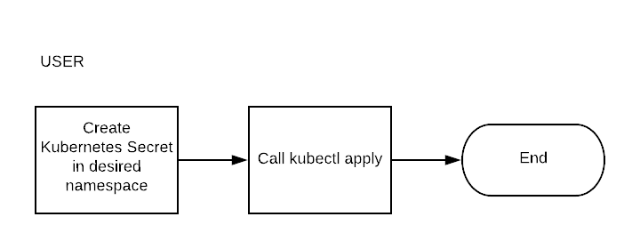
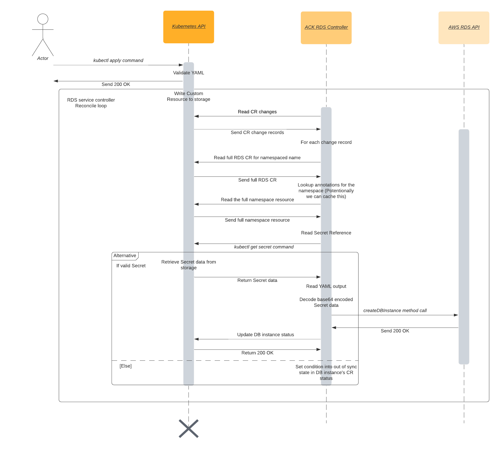

# Secrets Integration Design Doc

## Problem Description
Alice is a frequent Kubernetes user excited to create a database instance using Amazon RDS. She is very familiar with Kubernetes, but doesn't want to dive into learning about the Amazon API space. She is thrilled to use ACK, AWS Controllers for Kubernetes, to easily create a MySQL database. Before ACK, Alice needed to manually call the createDBInstance method from the RDS API in the AWS console, and type in a MasterUserPassword in plain text. With the method call to create and the method call to describe the DB instance, her password was in plain text for the API request and response. That didn't seem very secure to Alice. 
The Custom Resource Definition currently shows that the MasterUserPassword is a string:


Now with secrets integration in ACK, Alice creates a new Kubernetes secret and refers to the secret when creating a manifest of the DB Instance. When calling to describe the manifest, instead of her password printing explicitly in terminal, she sees the name of the secret reference that she created before. 


### In Scope
- Determine what fields in which API calls must be replaced by secret references
- Generate additional printer columns for service controller's CRD
- Retrieve secret information via a call to the Kubernetes API
- Integrate full end to end testing with one RDS API
- Support secret implementation for create actions for Amazon RDS (specifically createDBInstance, createDBCluster, and createDBSnapshot)

### Out of Scope
- Support for referencing secrets across different Kubernetes namespaces
- Support for other actions of RDS API not specified above
- Support for additional AWS APIs
- Support for external secrets management systems


## Solution Implementation 
The proposed solution will first solve the problem of how to identify which fields must be replaced using YAML files within target directories. The fields with sensitive information will first be manually identified and marked to be changed in a YAML file such as the one below.

```yaml
secretRefs:
  api: rds
    - action: CreateDBInstance
      fields:
        MasterUserPassword
    - action: CreateDBCluster
```

These API specific YAML files will be available for users to download and save into their directories of choice.
Let us assume the user Alice wants to use the Amazon RDS API to create a new DB Instance. Alice must create a Kubernetes Secret in the desired namespace and save the RDS YAML file in the directory she would like the DBInstance to reside in. Then, she simply calls the kubectl apply command, passes in her specification, and waits for a response from the Kubernetes API server.
The user's process is shown below.



Upon Alice calling the command, the Kubernetes API server writes the new CR to storage. 
The ACK RDS controller detects the change, reads the CR, and calls the Kubernetes API to retrieve the Secret information. The controller then reads the output, decodes the Secret value, and calls the createDBInstance method from the RDS API, passing in the decoded Secret for the field MasterUserPassword. The controller will store the DB instance identifier with the Secret reference and field name for future use, and write the CR for the new DB instance. Lastly, the Kubernetes API server receives an updated status and sends back a response to the user.
These processes are shown below.


The solution process is shown in the diagram below.



Later, if the user wants to describe the DB instance, the ACK controller will search for the DB identifier within the existing store of field names, DB identifiers, and Secret references to match and replace any potential Secret values with their references. 

## Alternative Solutions Considered
- Programmatically determine which fields contain sensitive information. 

