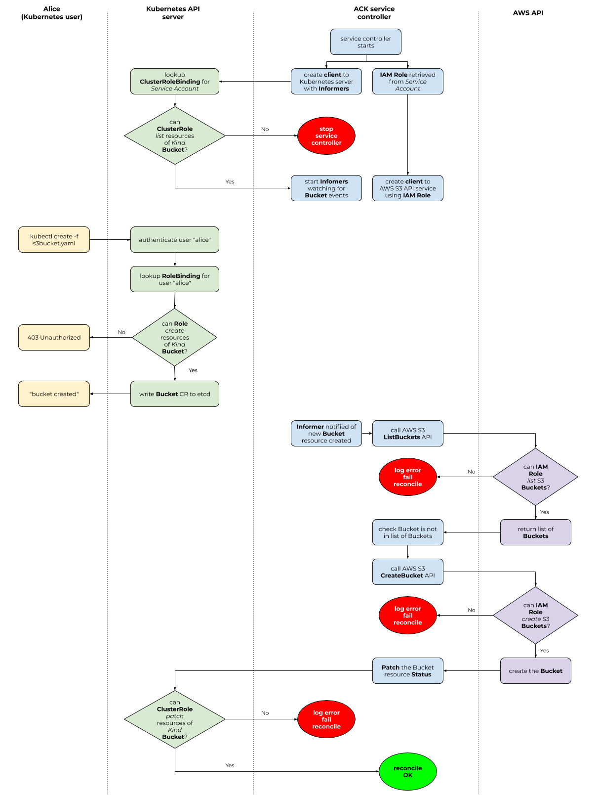

# Authorization

When we talk about authorization and access control for ACK, we need to discuss
two different Role-based Access Control (RBAC) systems.

Remember that [Kubernetes RBAC][0] governs a **Kubernetes** user's ability to
read or write **Kubernetes resources**. In the case of ACK, this means that
Kubernetes RBAC system controls the ability of a Kubernetes user to read or
write different custom resources (CRs) that ACK service controllers use.

[0]: https://kubernetes.io/docs/reference/access-authn-authz/authorization/

On the other end of the authorization spectrum, you can use AWS Identity and
Access Management (IAM) **Policies** to governs the ability of an **AWS IAM
Role** to read or write certain **AWS resources**.

!!! note "IAM is more than RBAC"
    AWS IAM is more than just an RBAC system. It handles
    authentication/identification and can be used to build Attribute-based
    Access Control (ABAC) systems. In this document, however, we're focusing on
    using IAM primitives to establish an RBAC system.

**These two RBAC systems do not overlap**. The Kubernetes user that calls the
Kubernetes API via calls to `kubectl` **has no association with an IAM Role**.
Instead, it is the Service Account running the ACK service controller's Pod
that is associated with an IAM Role and is thus governed by the IAM RBAC
system.



!!! note "RBAC authorization mode"
    The above diagram assumes you are running Kubernetes API server with
    the [RBAC authorization mode][1] enabled.

[1]: https://kubernetes.io/docs/reference/access-authn-authz/rbac/

## Configure permissions

Because ACK bridges the Kubernetes and AWS APIs, before using ACK service
controllers, you will need to do some initial configuration around Kubernetes
and AWS Identity and Access Management (IAM) permissions.

### Configuring Kubernetes RBAC

As part of installation, certain Kubernetes `Role` resources will be created
that contain permissions to modify the Kubernetes custom resources (CRs) that
the ACK service controller is responsible for.

!!! note "Important"
    All Kubernetes CRs managed by an ACK service controller are
    Namespaced resources; that is, there are no cluster-scoped ACK-managed CRs.

By default, the following Kubernetes `Role` resources are created when
installing an ACK service controller:

* `ack.user`: a `Role` used for reading and mutating namespace-scoped custom
  resources that the service controller manages.
* `ack.reader`: a `Role` used for reading namespaced-scoped custom resources
  that the service controller manages.

When installing a service controller, if the `Role` already exists (because an
ACK controller for a different AWS service has previously been installed),
permissions to manage CRDs and CRs associated with the installed controller's
AWS service are added to the existing `Role`.

For example, if you installed the ACK service controller for AWS S3, during
that installation process, the `ack-user` `Role` would have been granted
read/write permissions to create CRs with a GroupKind of
`s3.services.k8s.aws/Bucket` within a specific Kubernetes `Namespace`.
Likewise the `ack-reader` `Role` would have been granted read permissions to
view CRs with a GroupKind of `s3.services.k8s.aws`.

If you later installed the ACK service controller for AWS SNS, the installation
process would have added permissions to the `ack-user` `Role` to read/write CRs
of GroupKind `sns.services.k8s.aws/Topic` and added permissions to the
`ack.user` `Role` to read CRs of GroupKind `sns.services.k8s.aws/Topic`.

If you would like to use a differently-named Kubernetes `Role` than the
defaults, you are welcome to do so by modifying the Kubernetes manifests that
are used as part of the installation process.

Once the Kubernetes `Role` resources have been created, you will want to assign
a specific Kubernetes `User` to a particular `Role`. You do this using standard
Kubernetes `RoleBinding` resource.

For example, assume you want to have the Kubernetes `User` named "Alice" have
the ability to create, read, delete and modify CRs that ACK service controllers
manage in the Kubernetes "default" `Namespace`, you would create a
`RoleBinding` that looked like this:

```yaml
apiVersion: rbac.authorization.k8s.io/v1
kind: RoleBinding
metadata:
  name: ack-user
  namespace: default
subjects:
- kind: User
  name: Alice
  apiGroup: rbac.authorization.k8s.io
roleRef:
  kind: Role
  name: ack-user
  apiGroup: rbac.authorization.k8s.io
```

As always, if you are curious whether a particular Kubernetes user can perform
some action on a Kubernetes resource, you can use the `kubectl auth can-i`
command, like this example shows:

```
kubectl auth can-i create buckets --namespace default
```

### Configuring AWS IAM

Since ACK service controllers bridge the Kubernetes and AWS API worlds, in
addition to configuring Kubernetes RBAC permissions, you will need to ensure
that all AWS Identity and Access Management (IAM) roles and permissions have
been properly created.

The IAM Role that your ACK service controller runs as will need a different set
of [IAM Policies][2] depending on which AWS service API the service controller
is managing. For instance, the ACK service controller for S3 will need
permissions to read and write S3 Buckets.

We include with each service controller a recommended IAM Policy that restricts
the ACK service controller to taking only the actions that the IAM Role needs
to properly manage resources for that specific AWS service API. Within each
service controller's source code directory is a `config/iam/recommended-policy-arn`
document that contains the AWS Resource Name (ARN) of the recommended managed
policy for that service and can be applied to the IAM Role for the ACK service
controller by calling `aws iam attach-role-policy` on the contents of that file:

```bash
SERVICE=s3
BASE_URL=https://github.com/aws/aws-controllers-k8s/blob/main/services
POLICY_URL=$BASE_URL/$SERVICE/config/iam/recommended-policy-arn
POLICY_ARN="`wget -qO- $POLICY_URL`"
aws iam attach-role-policy \
    --role-name $IAM_ROLE \
    --policy-arn $POLICY_ARN
```
!!! note
    Set the `$IAM_ROLE` variable above to the ARN of the IAM Role the
    ACK service controller will run as.

[2]: https://docs.aws.amazon.com/IAM/latest/UserGuide/access_policies.html

## Cross-account resource management

TODO
