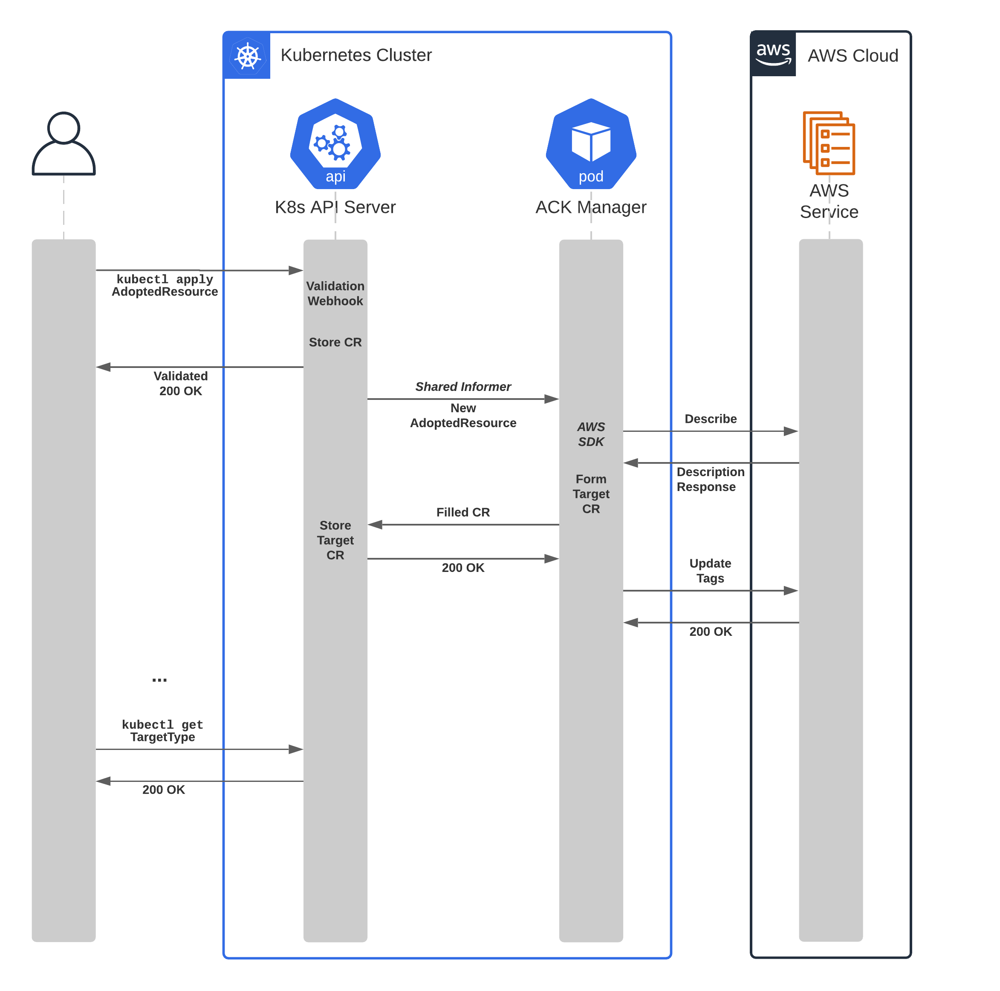

# Resource Adoption 

# The Problem

New ACK users typically have existing AWS resources in their accounts. These resources were not originally created by an ACK service controller. While ACK can create new resources, getting ACK service controllers to take over management of an existing resource is not yet supported.

The current method for migrating management of resources over to ACK requires users to store the current state of their applications, delete the resources, and re-create them using ACK. This process introduces places for bugs, loss of the state of existing deployments and downtime in production workloads.

ACK aims to provide the ability to “adopt” existing resources into your Kubernetes environment. Given the user can provide an IAM role which has access to existing resource, and that ACK controllers exist for each resource’s associated service, the ACK controller will be able to determine the current specification and status of the AWS resource and reconcile said resource as if the ACK controller had originally created it.

## Use Cases

1. Migrating existing architecture from another platform (CFN, CDK, Terraform, etc.)
    1. Resources exist but have never been managed by an ACK controller
3. Migrating architecture across K8s environments
    1. Resources are being managed by an ACK controller installed in another K8s cluster

# Proposed Implementation

## Overview

The proposed solution will provide an explicit workflow by which to adopt resources through a separate set of manifests. A new custom resource definition, the `AdoptedResource` CRD, provides a signal to ACK to adopt an existing resource. 
The `AdoptedResource` CRD references an existing AWS resource (either through ARN, name or other unique identifier) and a target Kubernetes `GroupVersionKind`. Each ACK controller will reconcile all adopted resources that match any of the types it controls (for the service it manages).
The manager will describe the referenced AWS resource, typically through a `Describe*` SDK call, and use the returned values to compile a new custom resource - with filled spec and status fields. The manager will then apply this custom resource to the cluster using the metadata applied in the `AdoptedResource` spec.

## `AdoptedResource` Specification

The `AdoptedResource` custom resource definition will allow for specification of an AWS resource unique identifier (in the `aws` field) and a target `kubernetes` field - containing Kubernetes `GroupVersionKind` and `metadata` sub-fields.

The `aws` resource unique identifier field allows identification through at most one of:

* `arn` - An [ARN](https://docs.aws.amazon.com/general/latest/gr/aws-arns-and-namespaces.html) (Amazon Resource Name)
* `nameOrID` - A resource name or identifier (a string value)

The custom resource definition makes no assumptions about which fields should be present for any given target kind. It is therefore up to the manager to validate the identifier input shape for existence and correctness.

The `kubernetes` field wraps the structures from `GroupVersionKind`, which specify the target ACK type through the following required fields:

* [API group and version](https://kubernetes.io/docs/concepts/overview/kubernetes-api/#api-groups-and-versioning)
* [Resource kind](https://kubernetes.io/docs/reference/kubectl/overview/#resource-types)

A validating webhook for the `AdoptedResource` custom resources will validate the existence of the target type in the cluster and ensure the requested type is able to be adopted. 

The `kubernetes.metadata` field is an optional [`ObjectMeta`](https://github.com/kubernetes/apimachinery/blob/4f505736214f6a32e70f37c6bae217360fe227b2/pkg/apis/meta/v1/types.go#L110) type that will be applied as the metadata for the created custom resource. If the `name` and/o `namespace` fields within the `metadata` spec is not defined, the respective fields from the `AdoptedResource` will be used as the value for the custom resource.

### Example Specifications

**1. An adopted S3 bucket with the minimal number of fields**

```yaml
apiVersion: s3.services.k8s.aws/v1alpha1
kind: AdoptedResource
metadata:
    name: adopted-data-bucket
spec:
    kubernetes:
        apiVersion: s3.services.k8s.aws/v1alpha1
        kind: Bucket
    aws:
        nameOrID: my-data-bucket
```

**2. An adopted S3 bucket with overriding metadata fields**

```yaml
apiVersion: s3.services.k8s.aws/v1alpha1
kind: AdoptedResource
metadata:
    name: adopted-data-bucket
spec:
    kubernetes:
        apiVersion: s3.services.k8s.aws/v1alpha1
        kind: Bucket
        metadata:
            name: data-bucket
            namespace: team-a
            annotations:
                ...
    aws:
        nameOrID: my-data-bucket
```

**3. An adopted API Gateway v2 API (using an ARN)**

```yaml
apiVersion: apigateway.services.k8s.aws/v1alpha1
kind: AdoptedResource
metadata:
    name: adopted-api-gateway
spec:
    kubernetes:
        apiVersion: apigateway.services.k8s.aws/v1alpha1
        kind: Api
    aws:
        arn: arn:aws:apigateway:us-east-1::/apis/123456789012
```

### Custom Resource Validation Webhook

In order to minimise the chance of user’s facing unexpected behaviours, a validating webhook will validate any adopted resource changes prior to submission to the ACK resource managers. The webhook will primarily **reject** the following error cases:

1. The provided target `GroupVersionKind` does not exist within the cluster
2. The target resource would override an existing resource
3. The target resource type cannot be adopted

## Adopted K8s Resource Tagging

All adopted resources will be annotated with an ACK-specific annotation that differentiates it from a natively created resource. This annotation serves to ensure clarity for users about possible specification differences introduced during the adoption process, or for filtering by adopted status. However, once adopted into a cluster, a resource will be reconciled with the same logic as any natively created resource. 

The proposed k8s adopted tag is `services.k8s.aws/adopted: true`

The adopted annotation would remain on the custom resource for the remainder of its lifecycle, and should not be modified by any other manager operation. 

## AWS Resource Tagging

AWS resources adopted by an ACK controller will have tags retroactively applied (whenever possible) to indicate its association with an ACK deployment. The details of these tags are discussed in another issue ([#148](https://github.com/aws/aws-controllers-k8s/issues/148)). ACK resource managers should not place any conditions on the existence of ACK tags on the AWS resources to gate the adoption process. The manager should should override any existing ACK tags.

## Resource Type Blocklisting

Adoption, for some resources, is not possible due to any number of the following reasons:

* They are ephemeral resources which don’t support additional lifecycle operations (one-time jobs)
* The service cannot provide adequate information to produce a full specification
* Unforeseen limitations within ACK or the service directly

For any of these cases, the resource can be marked as "not adoptable" and the validation webhook will subsequently reject any adopted resources of this type. Therefore, the manager will never attempt to run the adoption process. This option can be managed with a flag in the generator configuration file labelled `is_adoptable`.

## Adoption Process Diagram



# In Scope

* Declaration of the new `AdoptedResource` CRD
* Updates to generator for service-specific configuration
* New reconciler for `AdoptedResource` CRs within each service
* Validation webhook for `AdoptedResource` types
* Unit and E2E tests with a specific ACK controller (e.g. S3 buckets)

# Out of Scope

* Integration of adopted resource types for every ACK controller
* E2E tests for every ACK controller
* Tooling for generating `AdoptedResource` CRs

# Test Plan

## Unit Tests

* Assert validation webhook detects and rejects all blocked conditions
* Assert adopted resource reconciler filters and manages associated CRs
* Assert manager can create target CR type from description
* Assert manager makes call to update AWS resource tags

## E2E Tests

Requirements:

* 1 Kubernetes cluster
* 1+ Existing AWS resources
* 1 ACK controller (e.g. S3)
    * Minimum 1 adoptable resource type
    * Minimum 1 non-adoptable resource type

Procedure:

* Create `AdoptedResource` of target type that does not exist
    * Assert validation webhook fails
* Create `AdoptedResource` of target type that does exist
    * Assert controller creates target type resource
    * Assert created resource specification matches expected fields
    * Assert AWS resource tags have been updated
    * Assert status of created resource is stable
* Create `AdoptedResource` that has the same metadata name as previous
    * Assert validation webhook fails
* Create `AdoptedResource` of type that explicitly blocks adoption
    * Assert validation webhook fails

# Discussions

> How are users able to bulk import existing resources?

For users that hope to bulk import existing resources, an automated way of creating `AdoptedResource` custom resources would expedite the initial effort. This automation is outside the scope of this implementation. However, given a user can create all of the resources, and installs all the necessary controllers, the method of adopting many resources fundamentally remains the same as importing them all singly.


> How can I migrate across an ACK installation using adopted resources to maintain application state?

The following workflow may apply to this transition:

1. Export the identifiers (ARNs/IDs) from the current installation resources’ states
2. Create `AdoptedResource` CRs for each of these identifiers
3. Install and configure all necessary controllers to the new cluster
4. Apply the `AdoptedResource` CRs to the cluster
    1. Wait for all resources to end up in terminal state
5. Delete the ACK controller deployments from the old installation
    1. Do NOT delete the custom resources, this will delete the underlying AWS resources
6. Apply existing manifests to override the newly created resources
    1. *Note: If their state is already as desired, this should not make any updates to the AWS resources*
7. Delete the custom resources from the old installation

See more discussion in [#41](https://github.com/aws/aws-controllers-k8s/issues/41)
