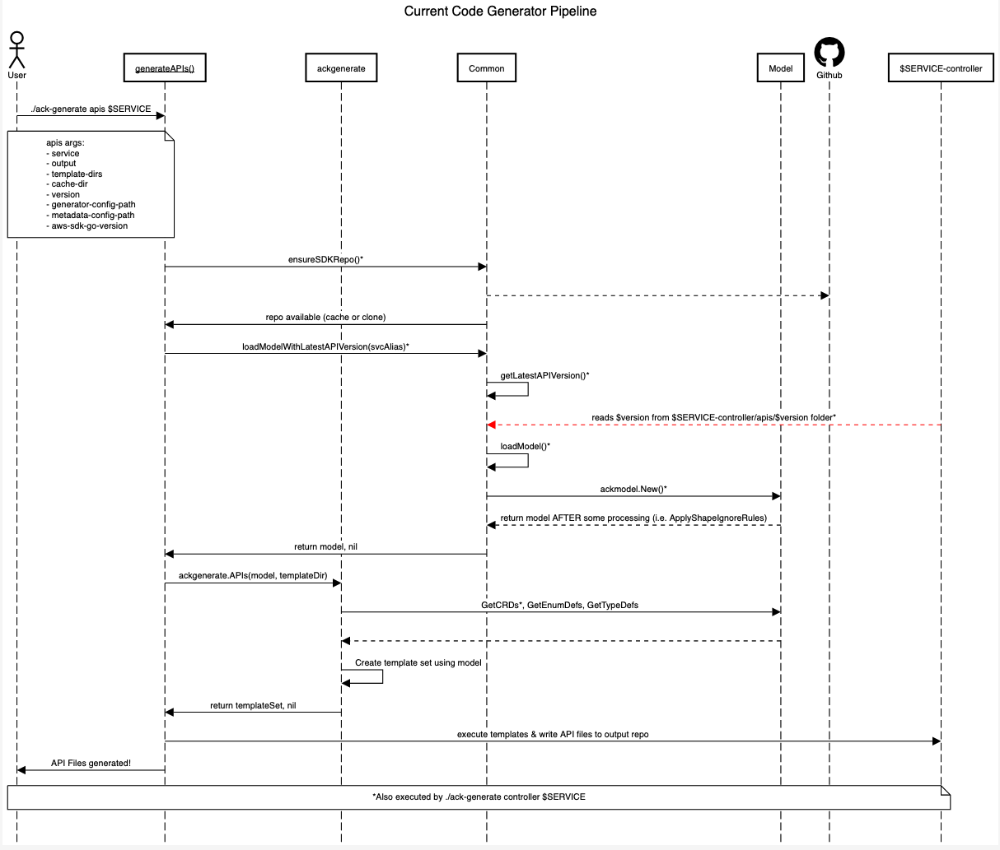
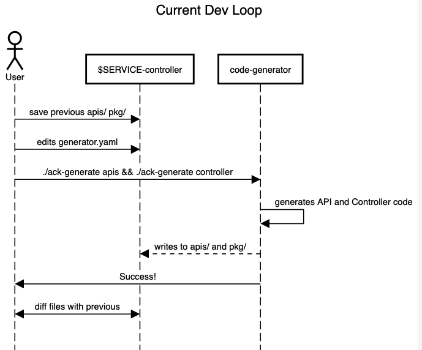
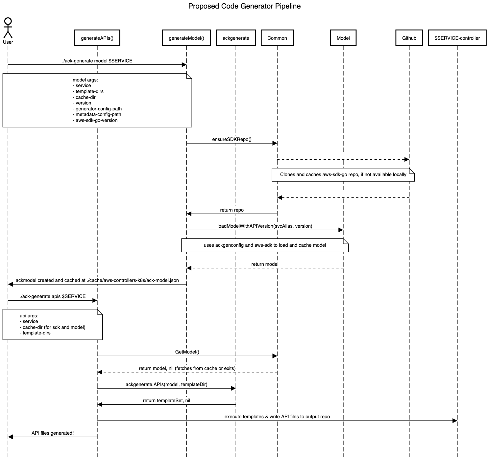
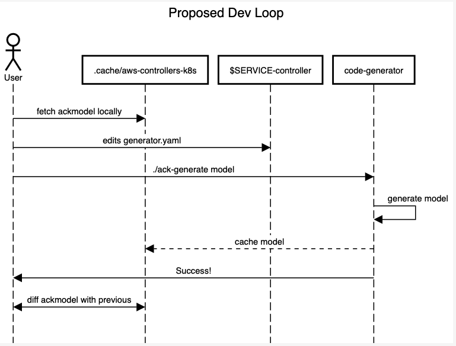

# Adding `model` command

### Key Terms
* `ackgenconfig`: the [code](https://github.com/aws-controllers-k8s/code-generator/blob/82c294c2e8fc6ba23baa0034520e84351bb7a32f/pkg/generate/config/config.go#L24) representation of *generator.yaml*. an **input** to *code-generator*.
* `resource` | `k8s-resource` | `ackcrd`: the [code](https://github.com/aws-controllers-k8s/code-generator/blob/82c294c2e8fc6ba23baa0034520e84351bb7a32f/pkg/model/crd.go#L63) reprensenting a single top-level resource in an AWS Service. *code-generator* generates these resources using heuristics and `ackgenconfig`.
* `shape` | `aws-sdk` | `sdk-shape` | `sdk`: the original operations, models, errors, structs for a given AWS service. sourced from *aws-sdk*, ex: [aws-sdk-go s3](https://github.com/aws/aws-sdk-go/blob/4fd4b72d1a40237285232f1b16c1d13de4f1220d/models/apis/s3/2006-03-01/api-2.json#L1)
* `API inference`: logic involving relations between `resource`, `shape`, `ackgenconfig`, and `aws-sdk`. Details [here](https://aws-controllers-k8s.github.io/community/docs/contributor-docs/api-inference/)
* `ackmodel`: the [code](https://github.com/aws-controllers-k8s/code-generator/blob/82c294c2e8fc6ba23baa0034520e84351bb7a32f/pkg/model/model.go#L36) representation of ACK's view of the world; the source of truth for `aws-sdk`, `ackgenconfig`, and `API inference`

## Problem
There are issues that are starting to degrade the code generation `pipeline` experience and will compound as *code-generator* continues to grow:
* Duplicate work between `api` and `controller` commands; both generate `ackmodel`
* Overloaded functions such as [SetResource](https://github.com/aws-controllers-k8s/code-generator/blob/82c294c2e8fc6ba23baa0034520e84351bb7a32f/pkg/generate/code/set_resource.go#L75); responsible for a lot more than generating Go code
* Confusing CX. There's a not-so-clear dependency on a folder in the $SERVICE-controller via [getLatestAPIVersion](https://github.com/aws-controllers-k8s/code-generator/blob/26e5da2e7656bb836ee438c05df14f2adc50197d/cmd/ack-generate/command/common.go#L271). This goes against the flow of the `pipeline` and creates confusion as there is a `--version` flag for the `apis` command (the above function takes precedence).
* Long dev loop; after making changes to either *generator.yaml* or logic in *code-generator* users need to either manually verify files or run e2e tests-- both of which are time consuming today
* How *code-generator* resolves `ackgenconfig` with `aws-sdk` to create `ackmodel` is inconsistent (and some duplicated work). For example, overrides such as `custom_shapes` [edit aws-sdk directly](https://github.com/aws-controllers-k8s/code-generator/blob/82c294c2e8fc6ba23baa0034520e84351bb7a32f/pkg/sdk/custom_shapes.go#L62-L63) while others such as `ignored_operations` [set operation values to nil](https://github.com/aws-controllers-k8s/code-generator/blob/26e5da2e7656bb836ee438c05df14f2adc50197d/pkg/model/model.go#L295) in memory leaving the actual operations in `aws-sdk` untouched.

Current Pipeline
---


* Displayed are the important and mostly duplicated calls between the `apis` and `controller` commands
* The cache is only used to store the `aws-sdk` repo
* The red line denotes a dependency on $SERVICE-controller (output directory) repo that should be removed
* Only `GetCRDs` is duplicated between the commands when creating the model


Current Dev Loop
---


* Validating the result of a change in *code-generator* and/or *generator.yaml* can be a lengthy process
* In the current feedback loop, users and contributors need to manually verify files or run lengthy e2e tests even for minor changes to `ackgenconfig`
  * *Note, can add unit tests to $SERVICE-controller such as [elasticache-controller](https://github.com/aws-controllers-k8s/elasticache-controller/blob/main/pkg/resource/replication_group/manager_test_suite_test.go) to speed up validation.*


## Solution
Add a new command, `model`, which takes in `aws-sdk` and *generator.yaml* as inputs, creates and stores `ackmodel` in cache as serialized JSON, then outputs the cached `ackmodel` location (default: `~./cache/aws-controllers-k8s/ack-model.json`). There's no impact to $SERVICE-controller directory. Existing commands, `api` and `controller`, will remove parameters for `aws-sdk` and *generator.yaml* and replace them with `ackmodel` input and/or let it default to `--cache-dir`.

Updated Pipeline
---

* This is not an exhaustive diagram of the calls, but shows the clear responsibility of `generateModel` and how downstream commands like `api` and `controller` become significantly lighter and easier to follow.
* `ackmodel` will be cached in the same folder as `aws-sdk` and downstream commands will check for `ackmodel` instead of `aws-sdk`
* users can override with a path to their own `ackmodel` (for even quicker testing!), but by default will check `--cach-dir`
* No more dependency on $SERVICE-controller repo. The `ackmodel` will be generated with a specific version which can be extracted after commands `GetACKModel()`

Updated Dev Loop:
---

* Diffing the `ackmodel` between *code-generator* runs will be quicker than manually checking files or running e2e tests
* Users can directly edit `ackmodel` or underlying `aws-sdk` / `ackgenconfig` then generate $SERVICE-controller for even quicker iteration loops


Updated `ackmodel` creation:
---
To address the inconsistent `ackmodel` creation, I propose we edit `aws-sdk` directly as much as we can, then introduce more fields to represent other relations that can't be applied by editing `aws-sdk`. Therefore, if we want to rename a field/resource, it would be instead completely removed from model. Conceptually:

```
func (m *Model) RenameShapes() error {
  for shapeName, shape := range m.SDKAPI.API.Shapes {
    if m.cfg.shapeRenamed(shapeName) {
      updateName := m.cfg.GetShapeName(shapeName)
      m.SDKAPI.Shapes[updatedName] = shape
      delete(shapeName, shape)
    }
  }
}
```

Downstream funcs like `SetResource` become easier to use because iterating like so will already have `ackgenconfig` applied:

```
updatedShape := m.GetOutputShape(outputShape)

for memberIndex, memberName := range updatedShape.MemberNames() {
  // updatedShape already has its fields renamed, removed, or added to based
  ...
}

```

After implementing the `model` command, not only can we create more commands to use `ackmodel` as a data source (i.e. a `generate-tests` command) but when it comes time to refactor *generator.yaml* interface we only need to touch `model` command and its underlying logic.

### Requirements
* Code generation `pipeline` flows in a single direction
* Optimize `pipeline` by removing repeated work
* Logic to create `ackmodel`, parse `ackgenconfig`, and resolve differences with `aws-sdk` is centralized and consistent

## Implementation

### Prerequisites
* Analyze and fill any test gaps
* Is the helper/loader exposed by AWS powerful enough to make these edits without being too convoluted? Can push complexity down.
  * What kind of relations **cannot** be captured by editing `aws-sdk`? These will need to be mapped as attributes in `ackmodel`
* Any issues with marshalling `ackmodel` with updated structs?

#### Create new `model` command
* Add `cmd/ack-generate/model.go`
* Move [loadModelWithLatestAPIVersion](https://github.com/aws-controllers-k8s/code-generator/blob/82c294c2e8fc6ba23baa0034520e84351bb7a32f/cmd/ack-generate/command/common.go#L219) and deps to use as `generateModel()`
  * remove checking the output directory and instead rely on `--version` to be passed in or default to `v1alpha1`
* Marhsall & cache `ackgenmodel` in `--cache-dir`


#### Update `api` and `controller` commands
* remove generator and sdk paramaters
* check cache for model; if none, exit and ask to re-run
* update calls in `build-controller` make target and scripts


#### Update `ackmodel` "merge" algorithm
* apply `ackgenconfig` directly to `model.SDKAPI` as much as possible
  * ex: remove setting `nil` for methods and obliterate them from SDKAPI instead
* update downstream callers to use the updated SDKAPI
* :warning: this would be a significant and potentially breaking change since we would be changing current algorithms :warning:


#### In Scope
* add `model` command
* update `pipeline` to use `model` and pass artifacts downstream to `api` and `controller`
* make naming consistent on *touched* code (i.e. `ensureSDKRepo` --> `getSDKRepo`)
* update `ackmodel`-creation algorithm to directly edit `aws-sdk` as much as possible
* tests related to this code
  * for a given `model` expect this generated code/types maybe?

#### Out of Scope
* resolving 3 different `op` and `op` types being passed around
* field-centric approach
* changes to *generator.yaml* interface


### Test plan
* After relocating logic to `ackmodel`:
  * execute code-generator against X services
  * run the e2e test suite for each service
  * resolve issues
* Save off the marshalled `ackmodel` from above test into `testdata/`
* Update tests to generate `ackmodel`, then compare it to expected blob in `testdata/`


### Alternative Solutions

#### Odd lex, but okay
* write our own [Go interpreter](https://interpreterbook.com/) to take in `aws-sdk-go` and flags/config to generate controller code