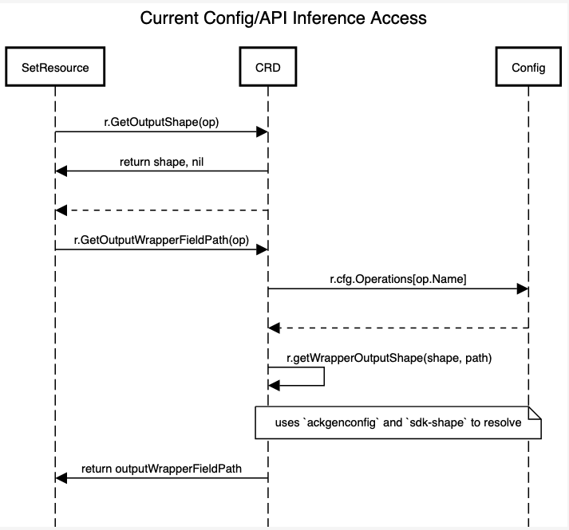
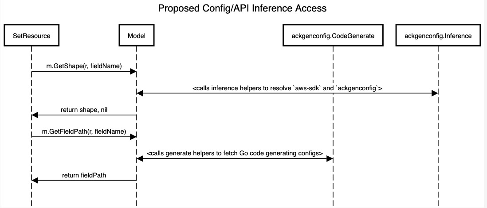
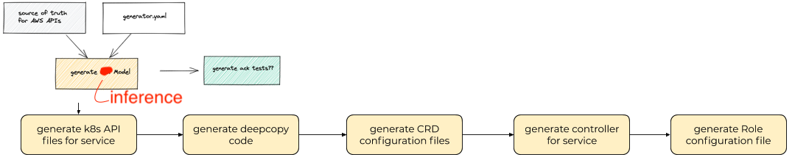

### Key Terms
* `ackgenconfig`: the [code](https://github.com/aws-controllers-k8s/code-generator/blob/82c294c2e8fc6ba23baa0034520e84351bb7a32f/pkg/generate/config/config.go#L24) representation of *generator.yaml*. an **input** to *code-generator*.
* `resource` | `k8s-resource` | `ackcrd`: the [code](https://github.com/aws-controllers-k8s/code-generator/blob/82c294c2e8fc6ba23baa0034520e84351bb7a32f/pkg/model/crd.go#L63) reprensenting a single top-level resource in an AWS Service. *code-generator* generates these resources using heuristics and `ackgenconfig`.
* `shape` | `aws-sdk` | `sdk-shape` | `sdk`: the original operations, models, errors, structs for a given AWS service. sourced from *aws-sdk*, ex: [aws-sdk-go s3](https://github.com/aws/aws-sdk-go/blob/4fd4b72d1a40237285232f1b16c1d13de4f1220d/models/apis/s3/2006-03-01/api-2.json#L1)
* `API inference`: logic involving relations between `resource`, `shape`, `ackgenconfig`, and `aws-sdk`. Details [here](https://aws-controllers-k8s.github.io/community/docs/contributor-docs/api-inference/)
* `ackmodel`: the [code](https://github.com/aws-controllers-k8s/code-generator/blob/82c294c2e8fc6ba23baa0034520e84351bb7a32f/pkg/model/model.go#L36) representation of ACK's view of the world; the source of truth for `aws-sdk`, `ackgenconfig`, and `API inference`

## Problem
*code-generator's* accelerated growth is resulting in tech debt that degrades the experience for platform maintainers and contributors. The codebase is becoming difficult to read and extend given the quick addition of features to onboard more services. This doc summarizes and introduces the proposals to eliminate significant tech debt so that development on ACK Platform is as pleasant and clear as it is open.

## Solution

### Overview
To improve the implementation, I propose consolidating `ackconfig` access and any *ackconfig-aws-sdk* `API inference` into `ackmodel`. Taking this idea further, `ackmodel` should be the "source of truth"/required input for `api` and `controller` commands instead of *generator.yaml* and *aws-sdk*.

### Requirements
* Refactor does **not change** existing functionality
* Code is easy to read, intuitive, and extendable
* Code generation processes remain clear and transparent

## Approach

### Centralize config access and API inference
By centralizing and consolidating config access and `API inference` logic, calls becomes significantly clearer. The diagrams compare the current and proposed function call paths:

* `r` represents a `resource` or `crd`
* `SetResource` calls `r.GetOutputShape(op)` to retrieve the shape for a given operation
* Then, `r.GetOutputWrapperFieldPath(op)` is invoked; it's basically a wrapper for accessing `ackgenconfig`
* Finally, `r.getWrapperOutputShape()` is called recursively and resolves which shape to return
* `r` is doing a lot of work and it isn't clear what is being resolved

---

* `m` represents `ackmodel`
* `SetResource` calls `m.GetOutputShape(op)` now instead of `crd`
* Under the hood, `ackmodel` will access its `ackgenconfig` to get config values
* Then use helpers to resolve between `sdk-shape` and `ackgenconfig`
* With `m` being the source of truth and `API inference` logic, it is safe to assume the output shape you get back takes all configs into account
* Also, `resource` is no longer bogged down with helpers unrelated to a `resource`

### New command `./ack-generate model`
With a new `model` command, the code generation can flow from a common data source which also creates opportunity for future commands:

## Design Proposals
The solution consists of 2 pieces. They don't necessarily depend on one another, but I recommend reviewing and implementing in the order below:
   * [Centralize config/model logic](./centralize_1.md)
   * [Introduce new command `model`](./model_cmd_2.md)