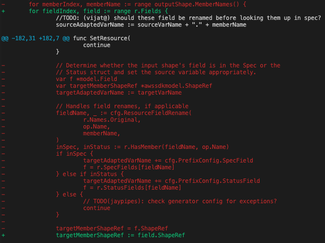

### Key Terms
* `ACK platform` | `platform`: the set of code generators, test frameworks, and model inference utilities that comprise the AWS Controllers for Kubernetes project.
* `pipeline`: the collection of all phases involved in code generation; depicted in this [diagram](https://aws-controllers-k8s.github.io/community/docs/contributor-docs/code-generation/#our-approach).
* `ackgenconfig`: the [code](https://github.com/aws-controllers-k8s/code-generator/blob/82c294c2e8fc6ba23baa0034520e84351bb7a32f/pkg/generate/config/config.go#L24) representation of *generator.yaml*. an **input** to *code-generator*.
* `resource` | `k8s-resource` | `ackcrd`: represented as CRD in [code](https://github.com/aws-controllers-k8s/code-generator/blob/82c294c2e8fc6ba23baa0034520e84351bb7a32f/pkg/model/crd.go#L63) is a single top-level resource in an AWS Service. *code-generator* generates these resources using heuristics and `ackgenconfig`.
* `shape` | `aws-sdk` | `sdk-shape` | `sdk`: the original operations, models, errors, structs for a given AWS service. sourced from *aws-sdk*, ex: [aws-sdk-go s3](https://github.com/aws/aws-sdk-go/blob/4fd4b72d1a40237285232f1b16c1d13de4f1220d/models/apis/s3/2006-03-01/api-2.json#L1).
* `API inference` | `inference` : the discovery or determination of the structure of API resources, including the fields of said resources and the relationship between resources in an API; details [here](https://aws-controllers-k8s.github.io/community/docs/contributor-docs/api-inference/).
* `ackmodel`: the *output* of the API inferece stage of the `pipeline`; represented in code as [Model](https://github.com/aws-controllers-k8s/code-generator/blob/82c294c2e8fc6ba23baa0034520e84351bb7a32f/pkg/model/model.go#L36).


## Problem
*code-generator's* accelerated growth is resulting in tech debt that degrades the experience for `platform` maintainers and contributors. The codebase is becoming difficult to read and extend given the quick addition of features to onboard more services. This doc summarizes and introduces proposals to eliminate significant tech debt and bring clarity to the `pipeline` so that development on `ACK platform` is as pleasant and clear as it is open.


## Solution

### Overview
The tech debt will be reduced after stratifying `ackgenconfig` into catgories and refactoring Go code generating logic. Code will be moved, modified, and new packages will be created in order to accomplish this effort. A new command, `infer-model`, will be added to the code-generator `pipeline` to make the overall flow clearer and more efficient. `infer-model` will resolve relations between `ackgenconfig` and `aws-sdk` and caches the "inference" data so that it can be consumed by downstream commands, `apis` and `controller`.

### Requirements
* Code is easy to read, intuitive, and extendable
* Code generation processes remain clear and transparent
* Code generation features and templates are usable for all use cases

## Approach

### Split `ackgenconfig` into 2 categories
Move configs to its own pkg, `pkg/config`, then split `ackgenconfig` into 2 categories:
  * `pkg/config/model.go`: configuration to handle `API inference`
  * `pkg/config/generate.go`: configuration to handle and direct code generation functions

The [Config struct](https://github.com/aws-controllers-k8s/code-generator/blob/02795c2056e23e1bb11dcc928ad0f0ba29790a8c/pkg/generate/config/config.go#L24) will retain all existing fields and add 2 new fields to represent the categories:

```
type Config struct {
  <existing fields>
  InferenceConfig *InferenceConfig
  GenerateConfig *GenerateConfig
}
```
This refactoring is meant to cleanup the codebase and implementations and therefore, will not be exposed in *generator.yaml*. After separating out these new fields (and helpers), it becomes easier to identify and improve code doing too much (i.e. dealing with both sets of configs) AND any duplicate work being done relating to these configs (such as with `API inference`) can be isolated and made more efficient. As such, this is a prerequisite for `model` command work.

### Generator enhancements
The `code` package is responsible for generating Go code, but has become overloaded with other functionality resulting in the accumulation of tech debt. This tech debt will be addressed in a number of ways:
* consolidating common logic/data
* reducing scope of overloaded methods
* removing duplicate code
* generalizing areas with hard-coded use cases.

### New command `./ack-generate model`
`model` takes `aws-sdk` and *generator.yaml* as **input**, discovers relations between the 2, persists and caches the data as serialized JSON, then **outputs** `ackmodel` (default location: `~./cache/aws-controllers-k8s/ack-model.json`). Existing commands, `apis` and `controller`, will be downstream and take `ackmodel` as an input. This will immediately improve the `pipeline` by removing duplicated `inference` work being done in both commands, thus cleaning up generator implementations like [SetResource](https://github.com/aws-controllers-k8s/code-generator/blob/02795c2056e23e1bb11dcc928ad0f0ba29790a8c/pkg/generate/code/set_resource.go#L142):


* Today, fetching renames and finding the corresponding field is `API inference` work being done by a *code-generating* function, `SetResource`
* After implementing `model` command, `inference` data will be **persisted** in `ackmodel` (containing `crds` and its fields). Then `SetResource` can iterate over this persisted data where `inferences` such as renames are either automatically applied or easily resolved by querying `ackmodel`.


Lastly, with a new `model` command, the code generation can flow from a common `inference` source which also creates opportunity for future commands:


## Design Proposals
The efforts described above do not necessarily depend on one another, but I recommend reviewing and implementing in the order below:
   * [`ackgenconfig` Categories](./inference.md)
   * [Generator Enhancements](./generator.md)
   * [`model` Command](./model_cmd.md)