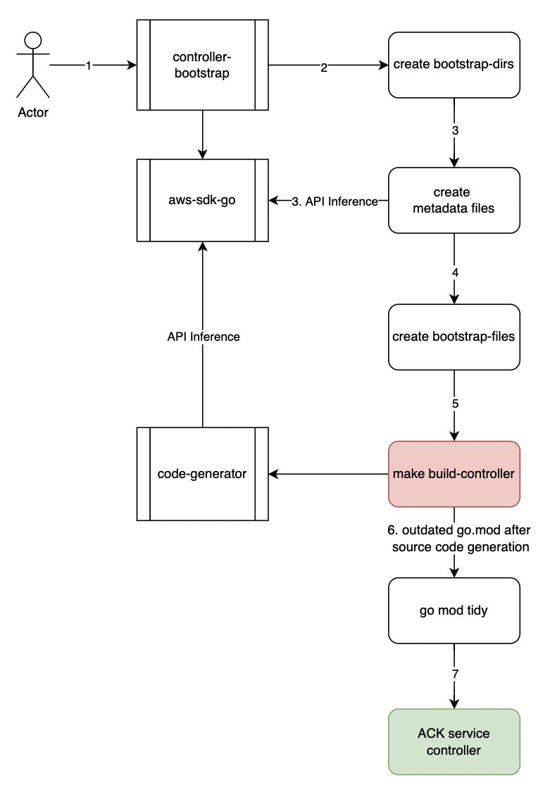
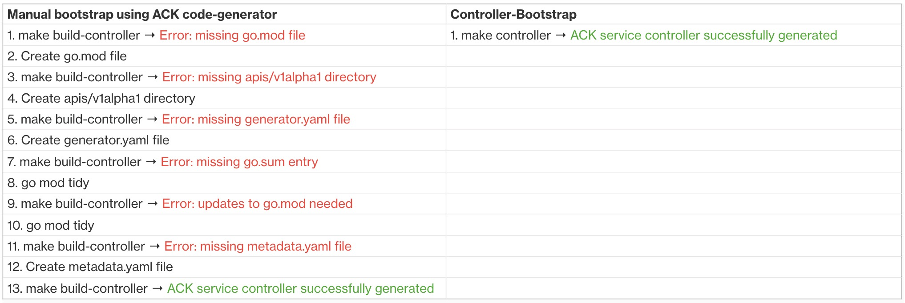

# Controller Bootstrap Design Document

## Introduction
This documentation discusses the design of the ACK *controller-bootstrap* for initializing a new ACK service controller repository.

To successfully generate a new ACK service controller, the service controller repository must have a few directories, such as `apis`, `olm`, `test/e2e`, and `templates`, in addition to the metadata files, `generator.yaml` and `metadata.yaml`, already present.
There are some other important files in all ACK service controllers, including `OWNERS` and `LICENSE`, which should also be present.

Even though the details of these initial directories and files can be documented for AWS service teams to bootstrap new service controller repositories, this approach suffers from the risk of outdated documentation. The documented process will also consist of multiple manual steps (copy-paste-edit) that are prone to operator error and can easily be automated.

The *controller-bootstrap* tool will solve these drawbacks by automating the repository bootstrap process, which will enhance the ACK onboarding experience for AWS service teams.

## Problem Overview


When developers attempt to build an ACK service controller with an empty service controller repository, they face multiple errors sequentially, including missing file/directory and outdated `go.mod` file, etc.
These require the developers to execute make build-controller command multiple times and fix each error as it surfaces. The list below mentions all the errors when building a service controller for the very first time.

> 1. make build-controller → Error: missing `go.mod` file
> 2. Create `go.mod` file
> 3. make build-controller → Error: missing `apis/v1alpha1` directory
> 4. Create `apis/v1alpha1` directory
> 5. make build-controller → Error: missing `generator.yaml` file
> 6. Create `generator.yaml` file
> 7. make build-controller → Error: missing `go.sum` entry
> 8. go mod tidy
> 9. make build-controller → Error: updates to `go.mod` needed
> 10. go mod tidy
> 11. make build-controller → Error: missing `metadata.yaml` file
> 12. Create `metadata.yaml` file
> 13. make build-controller → ACK service controller successfully generated

There is also an additional overhead for developers to refer to `aws-sdk-go` for creating `go.mod`, `generator.yaml`, `metadata.yaml` files and finding the values for service metadata and resource names.

## Nomenclature
* **api-2.json**: `api-2.json` file is the source of truth for the AWS service metadata, operations, and shape, and the file is present inside the `aws-sdk-go.models/apis` directory.
* **API inference**: ACK introspects the `api-2.json` file and determines which `CustomResourceDefinitions` (CRDs) to construct.
* **Service alias**: Service alias is the Go package name for the AWS service inside the `aws-sdk-go`.
* **Service model name**: The directory that contains the `api-2.json` file for an AWS service.
* **Service ID**: The `metadata.serviceID` field from the model `api-2.json` file.
* **bootstrap-dirs**: The bootstrap-dirs are directories added by the *controller-bootstrap*, which include `olm`, `templates`, and `test` directories.
* **bootstrap-files**: The bootstrap-files are files added by the *controller-bootstrap*, which include `create-release.yaml`, `olm-config.yaml`, `go.mod` files. These files are different for each controller.
* **metadata files**: The metadata files, including `generator.yaml` and `metadata.yaml`, contain the service metadata and ACK resources inferred from `aws-sdk-go`. The metadata files are generated by the *controller-bootstrap*, which are also used by the code-generator to build an ACK service controller.
* **project description files**: The project description files are files that will be updated in an existing service controller by the *controller-bootstrap*, which include `LICENSE`, `NOTICE`, `CODE_OF_CONDUCT.md` files. These files are same across all service controllers.

## Scope

#### Initial Implementation
* Automate the service bootstrap directory creation
* Automate the `aws-sdk-go` inference to generate the metadata files
* Add the dry-run functionality
* Bootstrap the controller repository with a single command
* Ability to configure the `aws-sdk-go` and ACK runtime version
* Update the existing ACK service controllers with the latest templates of static files (`OWNERS`, `CONTRIBUTING.md`, `NOTICE`, etc)
* Use smart defaulting for finding service names

#### Future Improvements
* Implement the functionality to automate running the *controller-bootstrap* and open a PR using ack-bot
* Support updating to a newer directory structure

#### Out of Scope
* Generating the Go source code for the ACK service controller (this is the purview of code-generator)

## Proposed Solution

### High Level Overview


1. The *controller-bootstrap* is a CLI tool that initializes an ACK service controller repository.
2. It creates bootstrap-dirs.
3. It queries `aws-sdk-go` for metadata about the service and resources.
4. It also creates initial bootstrap-files.
5. With the initial scaffolding in place, `make build-controller` gets executed without facing the missing files/directory errors.
6. The *controller-bootstrap* catches the expected errors, such as outdated `go.mod`, and executes `go mod tidy` command on the user’s behalf.
7. Lastly, the result is an auto-generated ACK controller, with all API resources listed as ignored in the `generator.yaml` file.

#### Customer Experience
The following snapshot shows the user experience when bootstrapping an empty controller repository. It is a single command execution requiring no additional steps from the user.
If there is a discrepancy between the supplied service alias and service ID, the user will be able to provide the service model name (discussed further in low level implementation).


The image below describes the output of service controller directory before and after executing `make init` in *controller-bootstrap*.

#### Before
`eks-controller/`

#### After


The following table shows the 13 manual steps with the code-generator converted into a single step with the *controller-bootstrap*.




### Low Level implementation

#### Choice of Language
The *controller-bootstrap* is a command-line tool and will be built using [Cobra](https://github.com/spf13/cobra#overview), which is widely used in Go projects to develop a user-friendly CLI application.
Cobra also has useful features of nested subcommands and flags for the bootstrap tool to provide additional functionalities and configurations for a better user experience.

We chose to use Golang for this tool instead of Python because other command-line tools inside ACK are built using Cobra CLI and this ensures that consistency.
In addition, `ack-generate` CLI inside the code-generator also serves as a perfect example for rendering template files and inferring `aws-sdk-go`. Also, the use of Golang in the *controller-bootstrap* allows reusing code from the ACK code-generator.

#### Command Line Arguments
In the *controller-bootstrap*, the user can run the following CLI command with the various inputs.

> `controller-bootstrap generate -s ${AWS_SERVICE} -r ${ACK_RUNTIME_VERSION} -v ${AWS_SDK_GO_VERSION} -d=${DRY_RUN} e=${EXISTING_CONTROLLER} -o ${PATH_TO_CONTROLLER_DIRECTORY} -m ${SERVICE_MODEL_NAME}`


The configurable inputs of the command refer to:

1. Supplied AWS service alias
2. ACK runtime and `aws-sdk-go` versions
3. Optional Dry-run functionality
4. Optional flag to update existing ACK service controller
5. Path to the ACK service controller repository to bootstrap
6. Optional input for service model name of the supplied service alias

#### Makefile Targets
However, most customers will use this tool with the Makefile targets present inside *controller-bootstrap* repository, which will provide an enhanced user experience. There will be the following targets:

1. `make init` generates an ACK service controller repository
2. `make update` updates an existing ACK service controller with project description files
3. `make` conditionally executes `make update` if the target controller already exists; otherwise, it executes `make init`

>Look at Appendix A1 for more details of the Makefile

#### API Inference
To generate the metadata files, the *controller-bootstrap* infers `aws-sdk-go` to fetch the accurate service metadata and the custom resource names. The proposed approach is to implement a method to read the `api-2.json` file from `aws-sdk-go/models/apis/<model-name>`, and extract the `serviceId`, `serviceFullName`, etc from the `metadata` section.
Also, this approach allows to extract all the “Create” operations from the `operations` section, which helps to determine the custom resource names.

#### Code-generator dependency
While it is possible to add the code-generator as dependency, and reuse the packages for `aws-sdk-go` inference and Go template rendering, the code-generator also has numerous other dependencies that are not needed for the *controller-bootstrap*, Ex: controller-runtime, api-machinery, etc.
Additionally, Go template rendering and `aws-sdk-go` inference are more advanced in the code-generator than required inside the bootstrap tool, Ex: inferring `aws-sdk-go` with `generator.yaml` to create crds, while bootstrap only needs to read the `api-2.json` file and find the Create* operations.
Due to these reasons, we chose to duplicate some of the methods from the code-generator in the *controller-bootstrap*. But in the future, the common code will be refactored, moved to `aws-controllers-k8s/pkg` directory and reused in both repositories.

## Appendix
A1. `Makefile` in *controller-bootstrap*

```makefile
SHELL := /bin/bash # Use bash syntax

# Set up variables
GO111MODULE=on

AWS_SERVICE=$(shell echo $(SERVICE))
SERVICE_MODEL_NAME=$(shell echo $(MODEL_NAME))
ifeq ($(MODEL_NAME),)
MODEL_NAME:=""
endif
GO_CMD_FLAGS=-tags codegen
CONTROLLER_BOOTSTRAP=./bin/controller-bootstrap
ROOT_DIR=$(shell dirname $(realpath $(firstword $(MAKEFILE_LIST))))
CODE_GEN_DIR=${ROOT_DIR}/../code-generator
CONTROLLER_DIR=${ROOT_DIR}/../${AWS_SERVICE}-controller
AWS_SDK_GO_VERSION=$(shell curl -H "Accept: application/vnd.github.v3+json" https://api.github.com/repos/aws/aws-sdk-go/releases/latest | jq -r '.tag_name')
ACK_RUNTIME_VERSION=$(shell curl -H "Accept: application/vnd.github.v3+json" https://api.github.com/repos/aws-controllers-k8s/runtime/releases/latest | jq -r '.tag_name')
.DEFAULT_GOAL=run
EXISTING_CONTROLLER="true"
DRY_RUN="false"

build:
    @go build ${GO_CMD_FLAGS} -o ${CONTROLLER_BOOTSTRAP} ./cmd/controller-bootstrap/.go

generate: build
    @${CONTROLLER_BOOTSTRAP} generate -s ${AWS_SERVICE} -r ${ACK_RUNTIME_VERSION} -v ${AWS_SDK_GO_VERSION} -d=${DRY_RUN} -o ${ROOT_DIR}/../${AWS_SERVICE}-controller -m ${SERVICE_MODEL_NAME}

update: build
    @${CONTROLLER_BOOTSTRAP} generate -s ${AWS_SERVICE} -r ${ACK_RUNTIME_VERSION} -v ${AWS_SDK_GO_VERSION} -d=${DRY_RUN} -e=${EXISTING_CONTROLLER} -o ${ROOT_DIR}/../${AWS_SERVICE}-controller -m ${SERVICE_MODEL_NAME}

init: generate
    @export SERVICE=${AWS_SERVICE}
    @echo "build controller attempt #1"
    @cd ${CODE_GEN_DIR} && make -i build-controller >/dev/null 2>/dev/null
    @echo "missing go.sum entry, running go mod tidy"
    @cd ${CONTROLLER_DIR} && go mod tidy
    @echo "build controller attempt #2"
    @cd ${CODE_GEN_DIR} && make -i build-controller >/dev/null 2>/dev/null
    @echo "go.sum outdated, running go mod tidy"
    @cd ${CONTROLLER_DIR} && go mod tidy
    @echo "final build controller attempt"
    @cd ${CODE_GEN_DIR} && make build-controller
    @echo "look inside ${AWS_SERVICE}-controller/generator.yaml for further instructions"

run:
    @if [ -f ${CONTROLLER_DIR}/cmd/controller/main.go ]; then \
        make update; \
    else \
        make init; \
    fi

clean:
@cd ${CONTROLLER_DIR}
@rm -rf ${CONTROLLER_DIR}/..?* ${CONTROLLER_DIR}/.[!.]* ${CONTROLLER_DIR}/*
```

## FAQ
>Why do we add ACK custom resource names in the `ignore` list of the `generator.yaml` file?

ACK custom resource names will be initially added to the `ignore` list of the `generator.yaml` file. The service teams can use the inferred custom resource names and build the `generator.yaml` to ignore, modify, and add new instructions for code generation.

>Why do we provide the latest version of ACK runtime and `aws-sdk-go`?

By default, we provide the latest version for ACK runtime and `aws-sdk-go` because the new `aws-sdk-go` version may update the set of `Operation` definitions in the `api-2.json` file.
The inferred ACK resources from the set of `Operation` will need to reflect any changes, as the resources influence the behaviour of the code generation.
In addition, every new release of ACK runtime is an upgrade of the prior version, so we want to provide the latest runtime version by default to build a new ACK service controller.
The user will also be able to specify the versions for ACK runtime and `aws-sdk-go` in the respective command line arguments.
