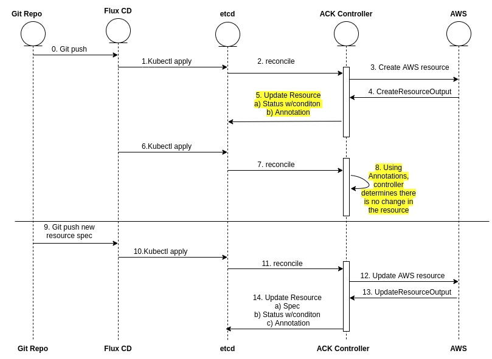

# ACK Handling Server Side Defaults

## Problem

During reconciliation, ACK service controller consumes the custom resource spec (i.e. desired state) from “etcd” and
then creates/updates the AWS resource to match that desired state. ACK service controller uses the custom resource spec
fields to construct Create/Update AWS API request.

However, some AWS API’s behavior does not completely rely on the fields present in Create/Update AWS API request alone.
In the backend, these AWS APIs sometime update the value of field present in request
with newly calculated value which represents the latest state of the resource in AWS. AWS APIs return these updated 
values with Create/Update API output and Read/List/Describe API output after resource creation.

Following problem arise due to this behavior of AWS APIs,

* When an AWS API does not strictly use the property value as is in the backend, but updates it, the desired spec of
the K8s resource in the “etcd” does not correctly represent the actual state of resource in AWS. This is a problem because
for K8s user, the spec of custom resource is the source of truth for state of K8s resource.


## Solution Requirements

1. Consistency with K8s conventions
2. Consistency across ACK service controllers
3. GitOps compatibility
4. User experience for custom resource lifecycle 

## Solution

In this solution, If an existing value is updated as part of Create/Update API output, ACK service controller will persist 
the details of server-side-overrides in the custom resource’s Annotation, add a condition in custom resource  status to 
indicate that server override some spec fieds.

> Note: The original value provided by the k8s user in desired spec will not be updated, even though server udated that value. 


1. *Consistency with K8s conventions* ✅
    1. In K8s convention, the spec fields are not duplicated into status fields.
2. *Consistency across ACK service controllers* ✅
3. *GitOps compatibility* ✅
    1. There should be no complexity in implementing GitOps for ACK custom resources. 
    2. Approach mentioned in low level design below should work.
4. *User experience for custom resource lifecycle* ✅
    1. Applying updates to custom resource will not be confusing for the user. Users will update the spec and service
     controller will create Update request based on new spec.

### High Level Design


[source](./images/server-side-override.drawio)


### Low Level Design

To implement the flow described in high level design, we will walk through reconciliation of an example resource through
following steps and layout in detail how these steps will be achieved by ACK controller. 
We assume that Fluxcd is used to apply desired state of custom resource.

1. Assume there is a custom resource with following spec and status fields.

    “fieldA” and “fieldC” are regular spec and status field respectively. “fieldA” is provided by K8s user and “fieldD” 
    is updated in status based on latest observation.
    
    overrideFieldB is modified by reconciler whenever the value is provided by the k8s user. Ex: “-xyz” gets appended to
    it’s value. 

    ```yaml
    Spec:
     fieldA string
     overrideFieldB string
    Status:
     fieldC string
    ```

    and the manifest file(desired state) looks like,

    ```yaml
    Spec:
     fieldA: valueA
     overrideFieldB: valueB
   ```

2.  When this resource is reconciled by the ACK service controller, we expect the CreateOutput to have following value 
    for these fields. fieldA → “valueA“, overrideFieldB → “valueB-xyz“, fieldC → ”valueC“
    
    Based on this result, ACK service controller will persist the following object in etcd:
    
    Annotations:
    
    ```yaml
    services.k8s.aws/spec-overrides: 
       “{ 
           \“overrideFieldB\”:
               {
                   \“userInput\”:\“valueB\”,
                   \“serverOverride\”:\“valueB-xyz\”
               }
       }”
       Spec:
        fieldA: valueA
        overrideFieldB: valueB
       Status:
        fieldC: valueC
        conditions:
        - type: ACK.ServerSideOverride
          status: True
          reason: ServerSideSpecOverride
          message: Spec override values are present in services.aws.k8s/spec-overrides annotation
    ```
   
    > Note: the annotation above has single string value. It is been broken into multiple lines to showcase the structure better.

3. During the next reconciliation of manifest mentioned in #1, the desired state will be constructed not just from spec 
   in etcd but also from the `services.k8s.aws/spec-overrides` Annotations. The desired object will look like the object
   persisted in etcd in #2

   After reading the desired state from etcd, the reconciler code will go through all the spec fields and see whether 
   they exist in the spec-override annotation map. If a corresponding entry exists, reconciler will marshall current 
   desired value of spec field and compare with “userInput” in annotation override, 

   * If there is no difference between “userInput” and marshalled desiredValue, reconciler will update the desired state
     with serverOverride from spec-override annotation. 

   * If the marshalled string does `not` match “userInput”, it means there was some change in manifest by the user, and 
     serverOverrides from the spec-override map will not be used for desired state.
     
   In this case, There will be no delta between desired and latest object, And no AWS updates will be triggered.

4. Now let’s assume that User updates the manifest. The manifest will look like

    ```yaml
    Spec:
     fieldA: valueA
     overrideFieldB: updatedValueB
    ```

    Now, during reconciliation, when the desired object is being constructed by parsing Annotations, reconciler will see
    that overrideFieldB was updated because the userInput inside AnnotationMap is not equal to the current value in manifest.
    Reconciler will remove the annotation for overrideFieldB.
    
5. At this time, the desired object looks different from latest object in AWS and an Update will happen. The result of 
   UpdateOutput will contain following fields, fieldA → “valueA”, overrideFieldB → “updatedValueB-xyz”

   During sdkUpdate, Annotations will be updated again. 

   The object persisted in etcd will look like

    ```yaml
    Annotations:
    services.k8s.aws/spec-overrides: 
    “{
        \“overrideFieldB\”:
            {
                \“userInput\”:\“updatedValueB\”,
                \“serverOverride\”:\“updatedValueB-xyz\”
            }
    }”
    Spec:
     fieldA: valueA
     overrideFieldB: updatedValueB-xyz
    Status:
     fieldC: valueC
     conditions:
     - type: ACK.ServerSideOverride
       status: True
       reason: ServerSideSpecOverride
       message: Spec override values are present in services.aws.k8s/spec-overrides annotation
    ```

    And that is how reconciler will handle simple case of server overrides of desired state.
    
### Pseudo Code Changes
TBD

## Alternate Solutions Considered

### Solution 1

In this solution, the status fields will include all the fields which are CreateOutput shape members. Current status 
fields are the CreateOutput shape members which are not present in CreateInput shape (spec fields).

During reconciliation, the Read(One|Many),Update request inputs will be created from desired state but giving precedence
to status fields over spec in case of conflict.


1. *Consistency with K8s conventions* ❌ 
    1. In K8s convention, the spec fields are not duplicated into status fields. This will confuse k8s users when they 
    describe their custom resources.
2. *Consistency across ACK service controllers* ✅
    1. There should be no complexity in following this approach across all ACK service controllers.
3. *GitOps compatibility* ✅
    1. There should be no complexity in implementing GitOps for ACK custom resources. 
    2. Approach mentioned in low level design below should work.
4. *User experience for custom resource lifecycle* ✅
    1. Applying updates to custom resource can become confusing for the user.
    2. To update custom resource spec, K8s user will have to check resource status because status will have most updated
     value of all the fields.

Other Cons :

* The number of status fields will be very large and there will be a lot of duplication in custom resource description


### Solution 2

This solution builds on top of “Solution 1”, with the assumption that “Problem” mentioned above is not very common 
amongst AWS APIs.

In this solution, service teams can specify the spec fields which will be duplicated in both spec and status of custom
resource using generator.yaml


1. *Consistency with K8s conventions* ❌ 
    1. In K8s convention, the spec fields are not duplicated into status fields. This will confuse k8s users when they 
    describe their custom resources.
2. *Consistency across ACK service controllers* ❌
    1. Since all AWS APIs do not have this “Problem”, behavior across different service controllers will not seem consistent.
3. *GitOps compatibility* ✅
    1. There should be no complexity in implementing GitOps for ACK custom resources. 
    2. Approach mentioned in low level design below should work.
4. *User experience for custom resource lifecycle* ✅
    1. Applying updates to custom resource can become confusing for the user.
    2. To update custom resource spec, K8s user will have to check resource status because status will have most updated
     value for some of the fields.
