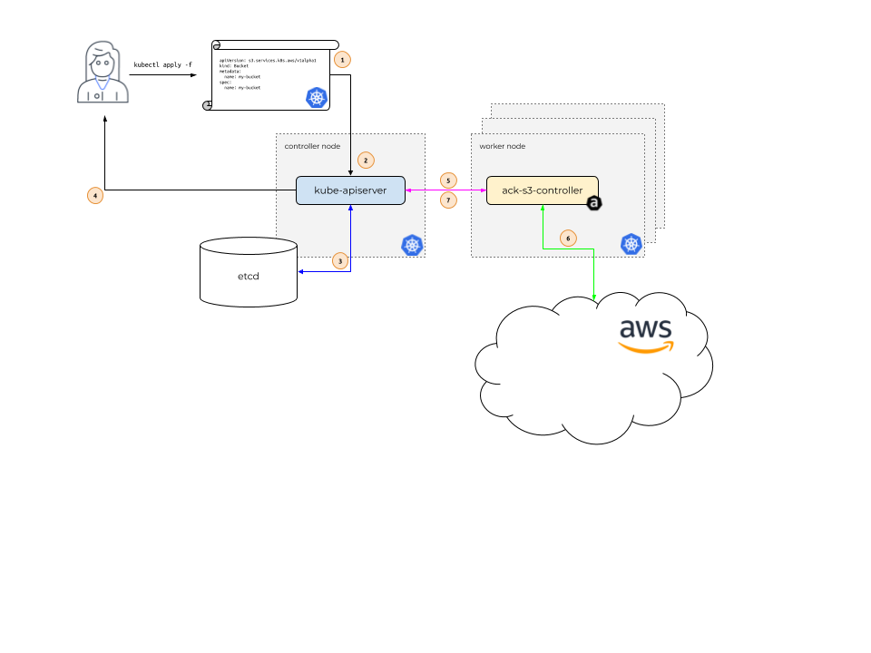

The idea behind AWS Controllers for Kubernetes (ACK) is to enable Kubernetes
users to describe the desired state of AWS resources using the Kubernetes API
and configuration language. In order to make this happen, let's take a look
under the covers and walk through how different components in the system
interact.

In the diagram above, Alice is our Kubernetes user. Her application depends on
the existence of an Amazon S3 Bucket named `my-bucket`.

Instead of creating the S3 Bucket via the AWS web console, Alice wants to only
use the Kubernetes API. After all, Alice uses the Kubernetes API to describe
all her application resources -- a `Deployment`, a `Service`, an `Ingress`,
etc. She'd like to use the Kubernetes API to describe all the resources her
application requires, including this S3 Bucket.

So, Alice issues a call to `kubectl apply`, passing in a file that describes a
Kubernetes [custom resource][crd] describing her S3 Bucket. `kubectl apply`
passes this file, called a [`Manifest`][manifest], to the Kubernetes API server
running in the Kubernetes controller node. `(1)`

The Kubernetes API server receives the `Manifest` describing the S3 Bucket and
determines if Alice [has permissions][authz] to create a custom resource (CR)
of [`Kind`][api-kind] `s3.services.k8s.aws/Bucket`, and that the custom
resource is properly formatted `(2)`.

If Alice is authorized and the CR is valid, the Kubernetes API server writes
`(3)` the CR to its `etcd` data store and then responds back `(4)` to Alice
that the CR has been created.

At this point, the ACK service [controller][controller] for S3, which is
running on a Kubernetes worker node within the context of a normal Kubernetes
[`Pod`][pod], is notified `(5)` that a new CR of `Kind`
`s3.services.k8s.aws/Bucket` has been created.

The ACK service controller for S3 then communicates `(6)` with the AWS S3 API,
calling the [S3 `CreateBucket` API call][s3-cb-api] to create the bucket in
AWS. After communicating with the S3 API, the ACK service controller then calls
the Kubernetes API server to update `(7)` the CR's [`Status`][spec-status] with
information it received from S3.

[api-kind]: https://kubernetes.io/docs/reference/using-api/api-concepts/#standard-api-terminology
[authz]: https://aws-controllers-k8s.github.io/community/user-docs/authorization/
[pod]: https://kubernetes.io/docs/concepts/workloads/pods/
[manifest]: https://kubernetes.io/docs/reference/glossary/?all=true#term-manifest
[controller]: https://kubernetes.io/docs/reference/glossary/?fundamental=true#term-controller
[crd]: https://kubernetes.io/docs/concepts/extend-kubernetes/api-extension/custom-resources/
[s3-cb-api]: https://docs.aws.amazon.com/AmazonS3/latest/API/API_CreateBucket.html
[spec-status]: https://kubernetes.io/docs/concepts/overview/working-with-objects/kubernetes-objects/#object-spec-and-status
