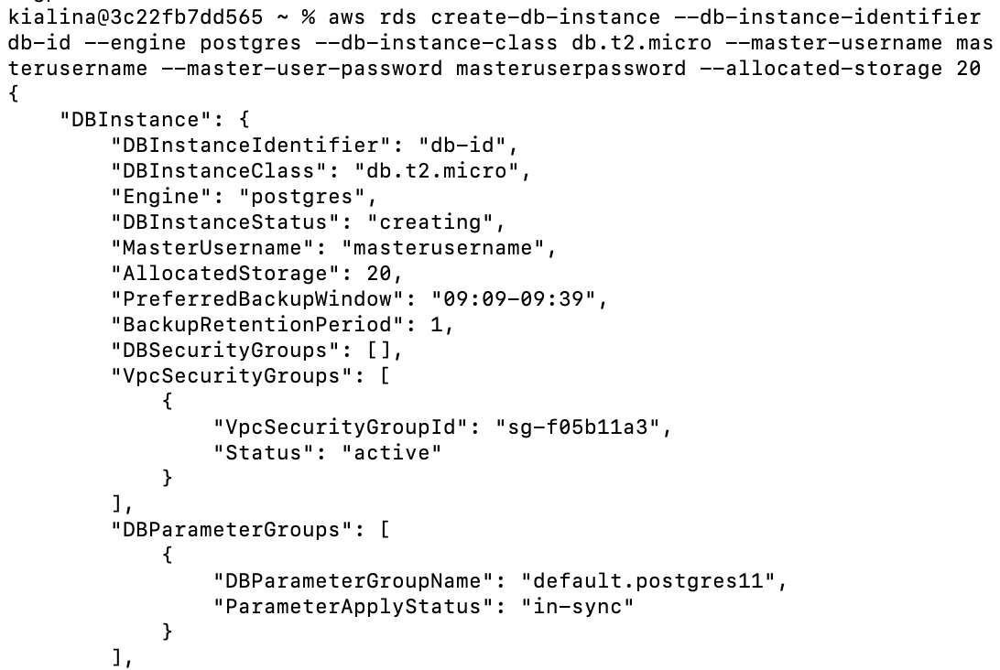
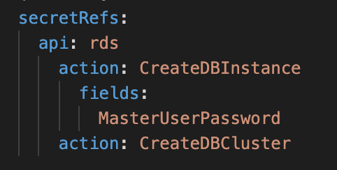

# Secrets Integration Design Doc

## Problem Description
Alice is a frequent Kubernetes user excited to create a database instance using Amazon RDS. She is very familiar with Kubernetes, but doesn't want to dive into learning about the Amazon API space. She is thrilled to use ACK, AWS Controllers for Kubernetes, to easily create a MySQL database. Before ACK, Alice needed to manually call the createDBInstance method from the RDS API in the AWS console, and type in a MasterUserPassword in plain text. With the method call to create and the method call to describe the DB instance, her password was in plain text for the API request and response. That didn't seem very secure to Alice. 
The command to run the script currently looks like this:

Now with secrets integration in ACK, Alice creates a new Kubernetes secret and refers to the secret when creating a manifest of the DB Instance. When calling to describe the manifest, instead of her password printing explicitly in terminal, she sees the name of the secret reference that she created before. 

### In Scope
- Determine what fields in which API calls must be replaced by secret references
- Generate additional printer columns for service controller's CRD
- Retrieve secret information via a call to the Kubernetes API
- Integrate full end to end testing with one RDS API
- Support secret implementation for create actions for Amazon RDS (specifically createDBInstance, createDBCluster, and createDBSnapshot)

### Out of Scope
- Support for referencing secrets across different Kubernetes namespaces
- Support for other actions of RDS API not specified above
- Support for additional AWS APIs
- Support for external secrets management systems

## Solution Implementation 
The proposed solution will first solve the problem of how to identify which fields must be replaced using YAML files within target directories. The fields with sensitive information will first be manually identified and marked to be changed in a YAML file such as the one below. 

Next, the code generator must be informed about the fields to replace with Kubernetes Secret references. 
As an example, if the method createDBInstance is called, the controller will check if there is a valid YAML file in the target directory. If so, the controller will read the file and detect first if createDBInstance matches any of the actions specified in the YAML file. If it does, the controller will request a Secret reference for the MasterUserPassword field specified. When a valid Secret reference is given, the controller stores the name of the specified field, in this case MasterUserPassword, with its unique DB identifier and Secret reference. The controller then retrieves the Secret value and passes it to the Amazon RDS API. 
Upon calling to describe the DB instance, after obtaining the relevant data from the RDS API, the ACK controller will look up the existing stored field names, DB identifiers, and Secret references to match and replace any potential Secret values with their references. 

## Alternative Solutions Considered
An alternative to manually listing fields is to programmatically determine which fields contain sensitive information. This solution poses a complication in that rules applicable to one method or API may not necessarily hold for others, and in the case of false negatives, the customer's privacy may be compromised. 